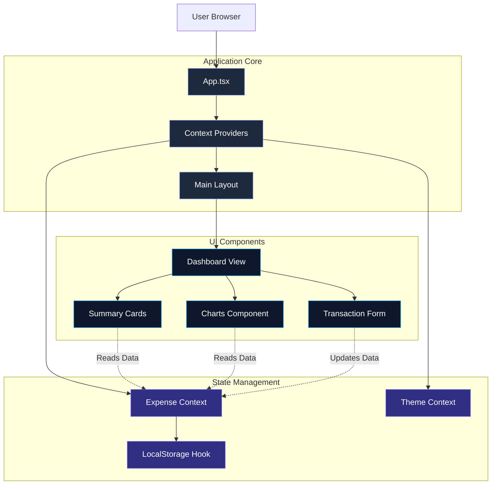

# Expense Tracker - Premium Neon Midnight Edition

A modern, visually stunning personal finance application built with React, TypeScript, and Vite. This application features a premium "Neon Midnight" dark mode, interactive charts, and a seamless user experience for tracking income and expenses.

## 🌟 Features

-   **Dashboard Overview**: Visualize your financial health with interactive bar and pie charts.
-   **Transaction Management**: Add (Income/Expense), view, and delete transactions with ease.
-   **PDF Export**: Download comprehensive monthly expense reports with a single click.
-   **Global Reset**: Quickly reset your dashboard and clear all data for a fresh start.
-   **Premium Dark Mode**: "Deep Midnight" radial gradient background with glowing neon accents and high-visibility text.
-   **Light Mode**: "Pencil & Paper" aesthetic for a classic feel.
-   **Data Persistence**: All data is saved locally in your browser using `localStorage`.
-   **Responsive Design**: Fully responsive layout optimized for desktop and mobile.

## 🛠 Tech Stack

-   **Framework**: [React 19](https://react.dev/) + [Vite](https://vitejs.dev/)
-   **Language**: [TypeScript](https://www.typescriptlang.org/)
-   **Styling**: [Tailwind CSS v4](https://tailwindcss.com/)
-   **Icons**: [Lucide React](https://lucide.dev/)
-   **Charts**: [Recharts](https://recharts.org/)
-   **PDF Generation**: [jspdf](https://github.com/parallax/jsPDF) + [jspdf-autotable](https://github.com/simonbengtsson/jsPDF-AutoTable)
-   **Animations**: [Framer Motion](https://www.framer.com/motion/)
-   **Date Handling**: [date-fns](https://date-fns.org/)
-   **State Management**: React Context API

## 🚀 Getting Started

### Prerequisites

-   Node.js (v18 or higher)
-   npm (v9 or higher)

### Installation

1.  Clone the repository:
    ```bash
    git clone https://github.com/PriyankaSDaida/Expenss_tracker.git
    cd Expenss_tracker
    ```

2.  Install dependencies:
    ```bash
    npm install
    ```

3.  Start the development server:
    ```bash
    npm run dev
    ```

4.  Open your browser and navigate to `http://localhost:5173`.

## 🏗 Architecture

The application follows a component-based architecture using React's Context API for global state management.

### Data Flow

1.  **Context Layer**: `ExpenseProvider` and `ThemeProvider` wrap the application, providing global access to transaction data and theme state.
2.  **Custom Hooks**:
    -   `useExpense()`: Accesses and modifies transaction data.
    -   `useTheme()`: Toggles between Light and Dark modes.
    -   `useLocalStorage()`: Handles data persistence to the browser.
3.  **Components**: Functional components consume these hooks to display data (Dashboard) or trigger updates (TransactionForm).

### System Component Diagram



## 📂 Project Structure

```
src/
├── components/          # React components
│   ├── dashboard/       # Dashboard specific components (Charts, Cards)
│   ├── transactions/    # Transaction related components (Form, List)
│   └── ui/              # Reusable UI components (Button, Input, Card)
├── context/             # React Context definitions
│   ├── ExpenseContext.tsx
│   └── ThemeContext.tsx
├── hooks/               # Custom hooks
│   └── useLocalStorage.ts
├── types/               # TypeScript interfaces and types
│   └── index.ts
├── App.tsx              # Main application component
└── index.css            # Global styles and Tailwind directives
```

## 🎨 Themes

-   **Dark Mode**: A modern, neon-inspired theme with a radial gradient background `radial-gradient(circle at center, #172554 0%, #020617 100%)`.
-   **Light Mode**: A clean, "pencil on paper" aesthetic with hand-drawn style fonts and decorations.

## 🤝 Contributing

1.  Fork the repository.
2.  Create a new branch (`git checkout -b feature/AmazingFeature`).
3.  Commit your changes (`git commit -m 'Add some AmazingFeature'`).
4.  Push to the branch (`git push origin feature/AmazingFeature`).
5.  Open a Pull Request.
